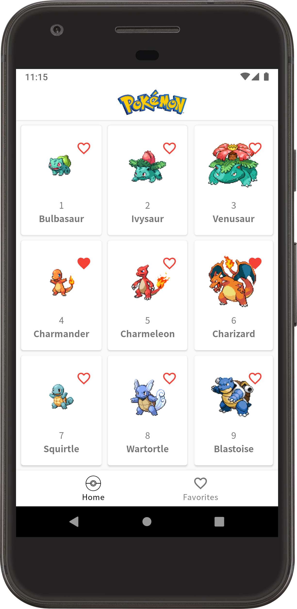
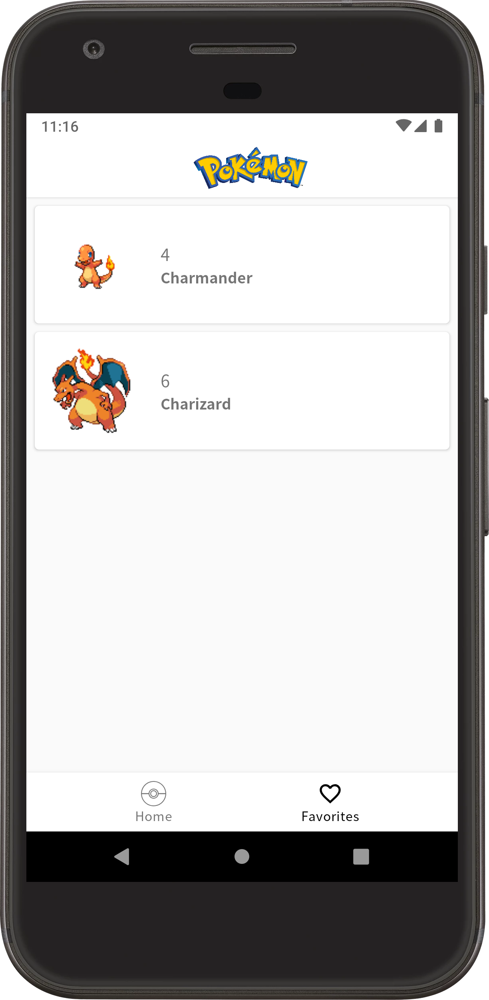
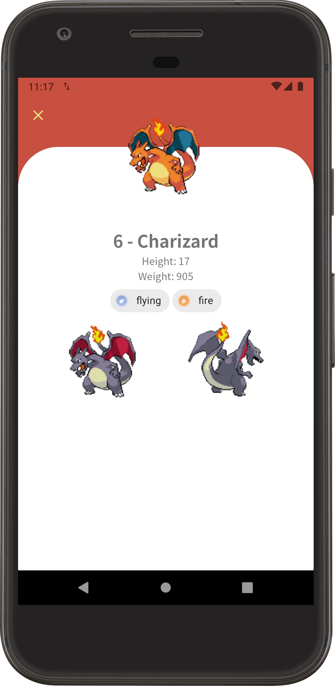

# Pokedex Kotlin
This is an example of Android App that uses pokeapi.co to show the first 251 Pokemons. I used Model View Presentation (MVP) architecture, because it's easy to understand and very testable.

First of all, thank you Nintendo, Pokemon is an awesome world, I can't forget to mention all the series, games, mangas etc., since 1996.

I can't forget to thank either all resources used in this project like pokeapi.co, libraries, fonts, drawables and codes.

## Tools/Libraries
    - Android extensions (KTX)
    - Constraintlayout
    - Google Material (Library)
    - Palette
    - ReactiveX: RxJava2 and RxAndroid2
    - Picasso
    - Gson
    - Retrofit2 (including RxAdapter2 and Gson Converter)
    - Chuck
    - Realm
    - Realm Browser
    - JUnit
    - Mockito Kotlin
    - Espresso: Core, Runner and Rules
    - Wiremock
    - [Notosans Font](OFL_LICENSE)

## Showcase

    
    
    

## LICENSE
MIT © [MIT](LICENSE)