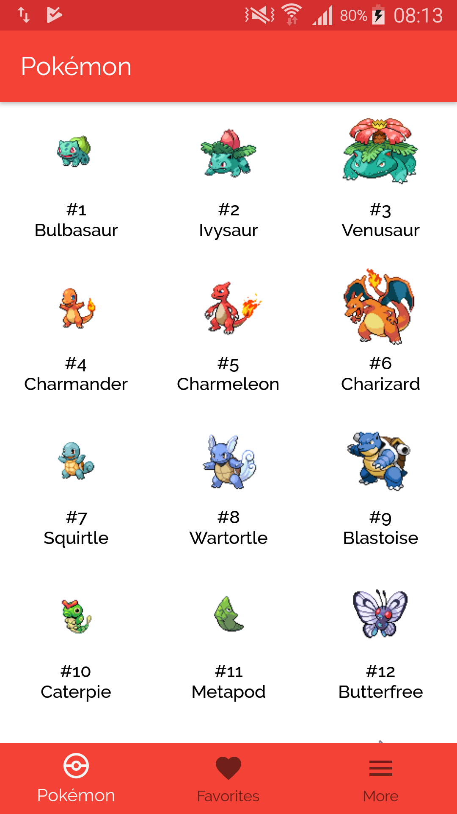

# Pokedex Kotlin

A very simple example using Kotlin and consuming pokeapi.co to produce a very small Pokedex to list 251 Pokémons.

Thank you Nintendo by produce a good game since 1996, pokecoapi and used libraries.

## Requirements

This project is structured by using some basic libraries and tools:
	- OKHttp
	- Retrofit
	- Calligraphy
	- RxAndroid
	- RxJava
	- Picasso
	- Chuck
	- Raleway (fonts)

## Showcase
---

  

